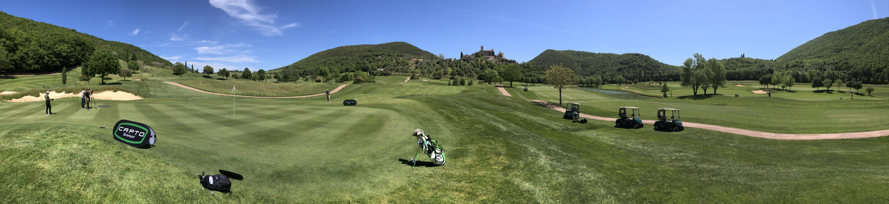

# Introduction

##Overview
Capto is a compact IMU platform specifically created for golf putting dynamic data acquisition and analysis.
It combines on-board sensors and data processing algorithms with WiFi interfaces to
create a versatile platform well suited to both real-time and data-logging applications.
The system is equipped with a powerful internal processor that processes the data and transfers it in real time to the analysis application.
The sensor is installed directly on the shaft of the putter and measures its angles, speeds, accelerations and trajectories with an internal frame rate of 600 Hz and output. 
The processed data is transferred to the device in real time at low frame rate (50 Hz) where some of they are numerically displayed in "Green" mode.
The processor inside the Capto module autonomously processes the parameters acquired by the sensor, filters them, identifies the shot and transfers it to the device via Wi-Fi. 
The sequence of all the frames is transferred, from the takeaway to the 300 Hz resampled finish. 
Doing so guarantees a very high graphic sampling with acceptable data transfer times from the module to the device.

## Sensor Module

|  Item |Value   |
| ------------ | ------------ |
|Gyroscope Range | 2000 deg/s |
|  Gyroscope Rate |  600 Hz |
|  Gyroscope Resolution |  16 bit |
|  Accelerometer Range |16 g |
|  Accelerometer Rate |  600 Hz |
|  Accelerometer Resolution |  16 bit |
|  Magnetometer Range |9000 uT |
|  Magnetometer Rate |  600 Hz |
|  Magnetometer Resolution |  16 bit |
|  AHRS Algorithm Rate |  270 Hz |
|  Static Angle Accuracy |  <1 deg RMS |
|  Wireless |  Wi-Fi|
|  External Power Supply |  4.5-6 V|
|  Charging |  USB-C|
|  Weight |  44 g|
| Box | Nylon PA12 Sintered|
|  Operating Temperature |  5-30 C|

On-board sensors include a triple-axis gyroscope, accelerometer, and magnetometer, as well a barometric pressure sensor and humidity sensor.  
An on-board AHRS sensor fusion algorithm combines inertial and magnetic measurements to provide a drift-free measurement of orientation relative to the Earth.  
Each device is individually calibrated using robotic equipment to achieve the specified accuracy.

## Software

The eFly app is available for iOS, Android, Windows and MacOS. For all of them the operating systems the interface remains unchanged. 
The app interfaces with the sensor via Wi-Fi, acquires data and synchronizes them with the video acquired by the device.
Capto allows you to save, consult and analyze data, both numerically and graphically with the help of synchronized video.

__The Capto App is available in Apple Store (iOS, MacOS), Google Play Store (Android) and [captogolf](https://www.captogolf.com/download) (Windows).__
